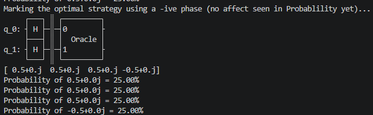
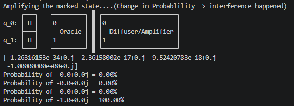

# 🌍 Quantum Geopolitics : Strategy Engine

## 📖 About this project
- This project is an evolving(under-development) geopolitical simulator built to learn and apply `Quantum Computing` & `Quantum Machine Learning` concepts only.
- Instead of traditional classical logic, this aims to use quantum mechanics principles to model the `complex`, `uncertain`, and `probabilistic` nature of international relation.

## 🛠️ Tech Stack
* **Backend & Quantum Logic:** Python, Qiskit, Numpy
* **Frontend(Planned):** ReactJS, HTML, CSS, JavaScript

## 🗺️ Development Progress
### Phase 1 : Mathematical Logic to prepare state-vector
- concepts applied:
    - proability amplitude, norm of vector, basis states, probability of each basis state &`NORMALIZATION`.
    ```python
    # NORMALIZATION to ensure Probability sum = 1
    norm_of_vector = np.sqrt(pow(abs(alpha), 2) + pow(abs(beta), 2))

    normalized_alpha = alpha / norm_of_vector
    normalized_beta = beta / norm_of_vector

    # state vector
    np.array([normalized_alpha, normalized_beta])

    # probablility
    pow(abs(normalized_alpha), 2) * 100
    ```

### Phase 2 : Diplomatic Events : changes in status quo & inteference
- concepts applied :
    - replaced `numpy state vector` simulation `{focus on the quantum state only and requires explicit linear algebra operations.}` with
    `Qiskit simulation`. `{focus on the quantum computation process (circuit), allowing to simulate diplomatic events using quantum gates while the framework handles state evolution internally.}`
    #### Events : 
    - `pauli X-gate` : determinstic turn of relations {100% peace <=> 100% conflict} 
    ```python
    self.relations_timeline.x(0) # since 1st qubit begins at index-0
    ```
    - `Hadamard (H) gate` : unpredictable outcomes of meetings (`superposition / interference`).
    ```python
    self.relations_timeline.h(0) # superposn (50%) or interference(100% conflict or peace due to introduction of interference)
    ```

### Phase 3 : Quantum Optimal Strategy Search : Grover's Search Algorithm
#### ⚙️ Approach
##### 1. Oracle : marks the `required state` via `phase-flip`
- identifies the `required state` and marks it.
- but this isn't visible until interference amplifies its `amplitude`.
- 

##### 2. Diffuser : cause interference
- calculates the `average amplitude` and store in `|00>` via `H-gate`
- flip amplitudes w.r.t. `average amplitude` to get new amplitudes.
- inteference causes amplitudes of `marked` state to amplify to &asymp; 1 i.e. `Prob = 100%` and amplitudes of `non-marked` states to shrink to &asymp; 0 i.e. `Prob = 0%`  
- 

##### 3. repeat (π/4) × √N, where N = 2<sup>n</sup>, n = number of qubits used. (here n = 2 => so only 1 iteration enough)